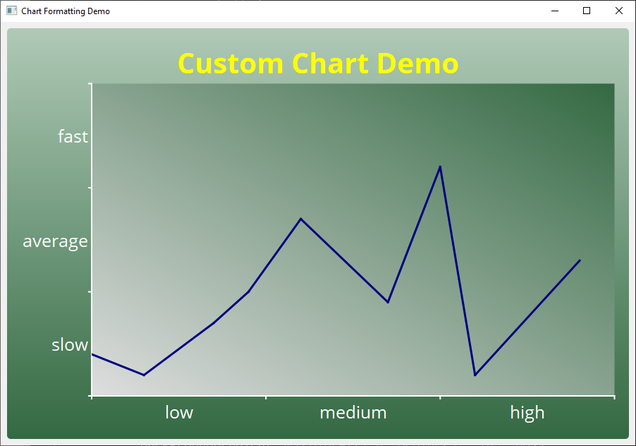

# [Customize PyQt5 Chart](https://learndataanalysis.org/how-to-customize-pyqt5-chart-with-an-example-pyqt5-tutorial/)

Chart creation with PyQt5 framework.

For work need to install:
```
pip install PyQt5
```
```
pip install PyQtChart
```
