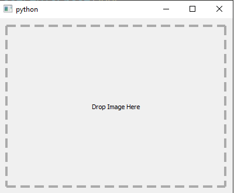

# [Implement Image Drag And Drop](https://learndataanalysis.org/how-to-implement-image-drag-and-drop-feature-pyqt5-tutorial/)

The image drag and drop feature is when you drag and image from your PC to a PyQt application, the application will detect the incoming signal and inserting the image.

