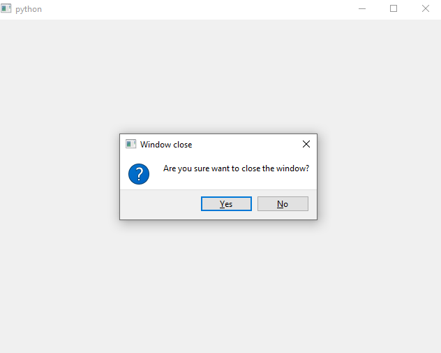

## [Example of how to use the QWidget Close Event](https://learndataanalysis.org/example-of-how-to-use-the-qwidget-close-event-pyqt5-tutorial/)

In this tutorial we are going to learn how PyQt5 QWidget Close event (signal) works by building a very simple PyQt app in Python.

