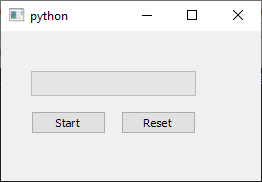

# Create a Simple Progress Bar with PyQt5 in Python 

Here is a Progress Bar widget, which can be used to display the progress of an operation.

The Progress Bar create with PyQt5 in Python to indicate progress status of an operation.

