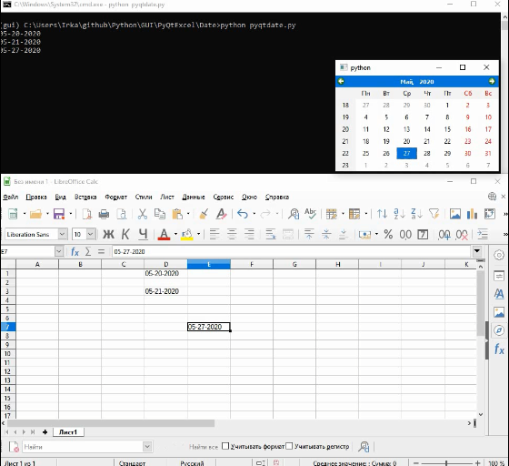

# [Create a date picker widget for your Excel spreadsheet](https://learndataanalysis.org/create-a-date-picker-widget-for-your-excel-spreadsheet-pyqt5-tutorial/)

Create a simple date picker tool for your Excel spreadsheet in Python.

For work with this code you need install pywin32



```
pip install pywin32
```

If you have Windows 64 bit, you can try [this](https://sourceforge.net/projects/pywin32/files/pywin32/Build%20219/).

File (table) must be opened.