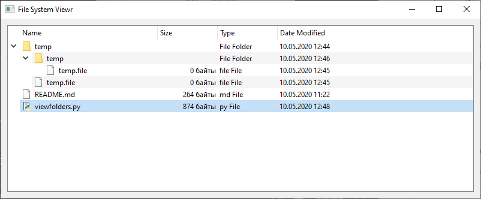

[App to View Folders and Files](https://learndataanalysis.org/create-an-app-to-view-folders-and-files-pyqt5-tutorial/)

In this tutorial we are going to learn how to build a simple PyQt5 application to display folders and files giving a directory in Python. 

